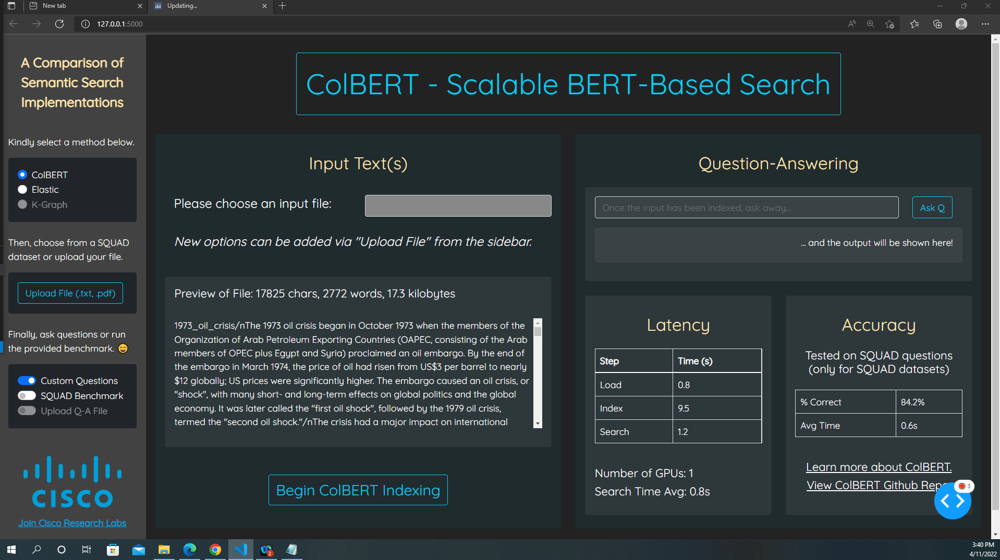
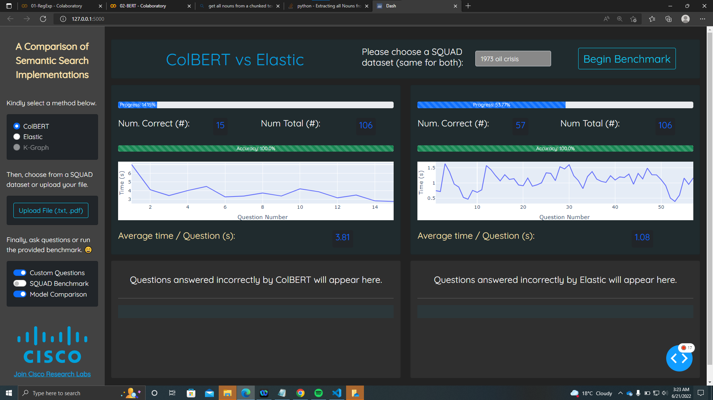

# BLAZE - Building Language Applications with eaZE 

[BLAZE Drag-and-Drop README](drag/README.md)

[BLAZE Conversational AI README](conv/README.md)

&nbsp;&nbsp;

The goal of BLAZE is to **make the lives of data scientists easier**, filling-in a required niche. 
BLAZE will allow plug-and-play for *models, datasets, tasks, and other parameters*. Users can 
quickly see how their model performs, identify what works and what doesn't, and compare their 
model to other models. 

## Features 

Here's BLAZE's current functionalities:

- **Custom Question-Answering** (ColBERT, Elasticsearch) 
  - Can use SQUAD texts (ex. 1973 Oil Crisis) or upload custom files (`.txt` support)
  - Allows users to enter questions, displays model's output
  - Gives latency, still need to update accuracy card (bottom right) 

  &nbsp;&nbsp;

  

  &nbsp;&nbsp;

- **Solo Benchmarking** (ColBERT, Elasticsearch) 
  - Can only use SQUAD texts (goes through ALL questions of chosen dataset) 
  - Gives latency (avg time/question, as well as generates real-time graph)
  - Gives accuracy (num correct, num total, % correct, % progress) 
  - Displays incorrect questions 

- **Model Comparison** (ColBERT, Elasticsearch)
  - Goes through all questions of chosen dataset on both models
  - Gives latency, accuracy, incorrect questions for both 
  - Allows for side-by-side comparison of performance 

  &nbsp;&nbsp;

  

  &nbsp;&nbsp;

- **Custom Summarization** (Bart-RXF)
  - Can upload custom files (`.txt` support), with dataset support coming soon 

Over the coming weeks, this platform will be further fleshed out with more exciting features 😄. 

&nbsp;&nbsp;

## Installation 

First, clone this repository by running:

`git clone https://github.com/jsrinivasa/ASKI.git`

Install faiss-gpu with

`conda install -c pytorch faiss-gpu`

 Next, create your conda environment with 

`conda env create -f aski_env.yml`

Then, activate your conda environment with 

`conda activate aski-benchmark`

Ensure that your elasticsearch client is up and running. For more information, see "Supported Models" section. 
Wait for ElasticSearch to load and ensure that your elasticsearch client is up and running. For more information, see 
"Supported Models" section. Finally, run the dashboard with: 

`python app_callbacks.py`

Now, a link should appear (ex. `Dash is running on http://127.0.0.1:5000/`). Run this link in your browser to open the dashboard! 

&nbsp;&nbsp;

A few heads up, there are **several edge-cases** that are currently being ironed out! 
- If something stops working, try restarting the dashboard and navigating to that page from fresh
- Make sure to **check the outputs of cmd** (helpful debugging info that might not be shown on the Dash)

&nbsp;&nbsp;

## Using the Conversational AI

Build the conversational model with

`python -m conv build`

(This step may take about 15 minutes without a GPU)

And run the AI in the command line with

`python -m conv converse`

To run the webex bot server, start an ngrok tunnel with

`ngrok http 8080 --region=eu`

It is important that the region is *not* 'us'.

Set the environment variables BOT_ACCESS_TOKEN (received when you register your bot) and WEBHOOK_URL (generated by ngrok) and change to the conv directory. Then run

`python webex_bot_server.py`

***Sources for training data***
- greet: food_ordering/greet/train.txt
- exit: food_ordering/exit/train.txt
- ask_question: manual data entry + mindmeld data augmentation
- get_summary: manual data entry + mindmeld data augmentation
- upload_data: manual data entry + mindmeld data augmentation

## Supported Models, Knowledge Bases

***Installing Elasticsearch***

Navigate to [Elasticsearch Installation](https://www.elastic.co/downloads/past-releases/elasticsearch-7-0-0) and 
follow the instructions according to your specific setup. 

> NOTE: ASKI does **not currently support** Elasticsearch 8 or higher! 

In order to launch elasticsearch, open a new terminal, navigate to the elasticsearch directory, and run either of the following: 
- `./bin/elasticsearch` (Linux/Mac)
- `.\bin\elasticsearch.bat` (Windows)

Now, leave this terminal window open! 

&nbsp;&nbsp;

***Installing ColBERT***

Clone the following [GitHub Repo (new-api branch)](https://github.com/stanford-futuredata/ColBERT/tree/new_api) into the `ColBERT` folder. 

> NOTE: There might be some issues with environments, these will be resolved by next commit! 

Once downloading the ColBERT files, make sure to uncomment the three lines near the top 
of the file `ColBERTSearch.py`. More instructions are detailed at the top of this file. 

After this, navigate to the `get_sidebar()` function in `app_elements.py` and make sure to 
toggle the "Disabled" option next to ColBERT. You should be good to go now! 

&nbsp;&nbsp;

***Installing Knowledge Graph***

Stay tuned, support for this is coming soon! 

&nbsp;&nbsp;
