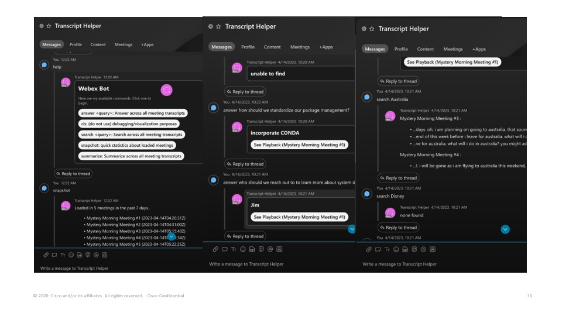
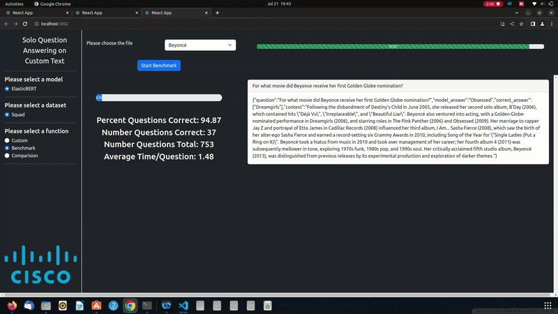
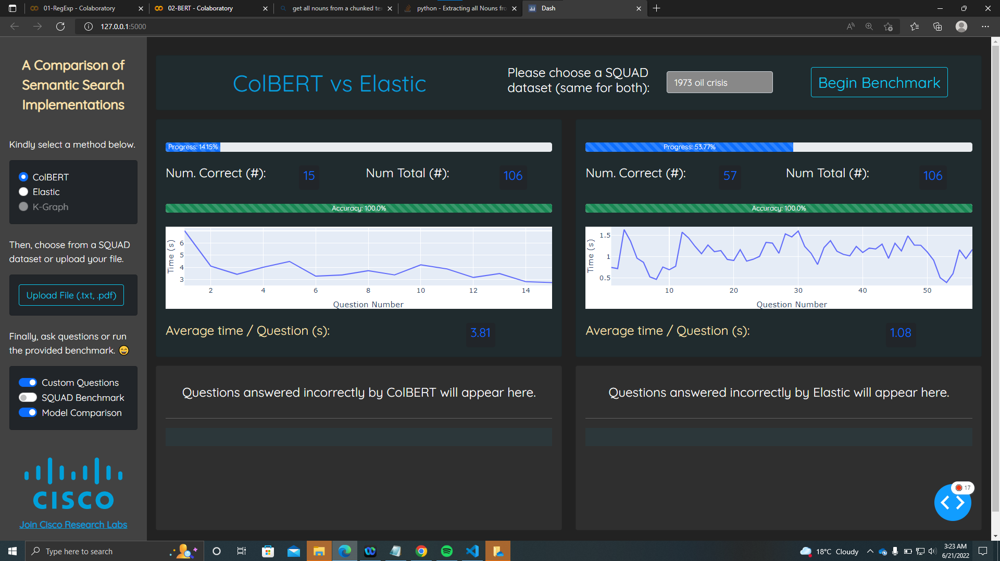
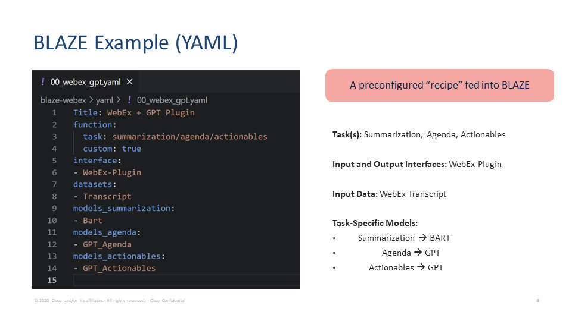
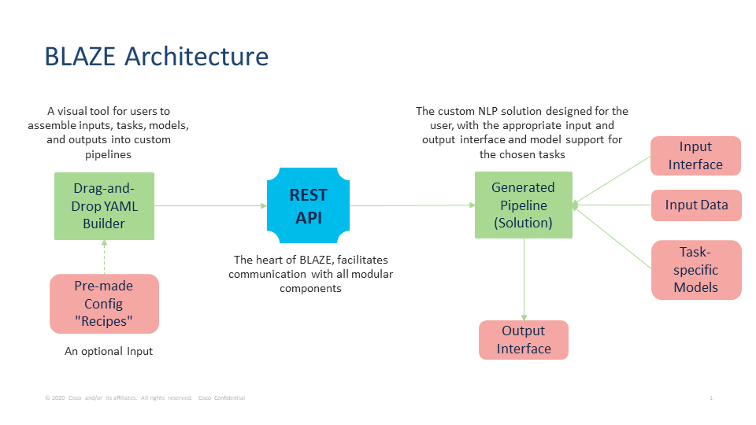

# BLAZE - Building Language Applications Easily 🔥

&nbsp;&nbsp;

> ***tl;dr*** - Cisco Research proudly presents BLAZE, a **flexible, standardized, no-code, open-source platform** to easily *assemble, modify, and deploy* various NLP models, datasets, and components

> Check out our [TechBlog](https://techblog.cisco.com/) and [Homepage](https://research.cisco.com/research-projects/blaze) for more information and exciting applications!

> Further technical documentation can also be found at our [Cisco Research GitHub Pages](https://cisco-open.github.io/BLAZE/). 

> Section-specific documentation can be found at the following smaller `README.md`'s:
> * Drag-and-Drop YAML Builder - [`drag/README.md`](./drag/README.md)
> * Generated YAML Files Folder - [`yaml/README.md`](./yaml/README.md)
> * Models Usage Instructions - [`backend/models/README.md`](./backend/models/README.md)

> Make sure to use the **Table of Contents** (the three horizontal lines next to README.md) for easier viewing!

&nbsp;&nbsp;

## What is BLAZE? 

BLAZE is designed to **streamline the integration of Natural Language Pipelines into software solutions**[^1]. We offer an open, extensible framework to benchmark existing solutions and compare them with novel ones.

[^1]: Check out our first [TechBlog](https://techblog.cisco.com/) to learn more about BLAZE's background! 

The building blocks of BLAZE are **flexible blocks of the NLP pipeline**. The functionality of different stages in the pipeline are abstracted out to create *blocks that can be combined in various ways*. Users can arrange these Lego-like blocks to create new recipes of varying NLP pipelines. 

In such, BLAZE will help democratize NLP applications, providing a no-code solution to experiment with SOTA research and serving as a framework to implement NLP pipeline recipes into usable solutions. 


&nbsp;&nbsp;

## Current Features

BLAZE currently supports the following building blocks and sample applications: 
| Category     | Current Components|
|:--------------:|:-----------------------------------------------------:|
| **Data(sets)** | SQUAD 2.0, *BillSum, XSum, CNN Dailymail*, HuggingFace* |
|  **User Data** | TXT files, WebEx Transcripts (Live, Pre-Recorded)     |
| **Processing** |         *Enterprise LLM Gateway, coming soon!*        |
|   **Models**   |   GPT-3 Variants, ColBERT, ElasticBERT, HuggingFace*  |
| **Metrics**    |   BertScore, Bleu, Rouge, Accuracy, Latency           |
| **Interfaces** | React App, Dash App, WebEx Bot, WebEx Plugin, POSTMAN |

> HF* - BLAZE's flexible design enables seamless integration of new components, many of which are underway!

> Data(sets)* - Summarization datasets are currently being stabilized, but will be ready with a few tweaks! 

&nbsp;&nbsp;

In addition, we have several sample applications, each of which are detailed below: 

1. **Semantic Search on User-Uploaded Documents** - [TechBlog: Building WebApps with BLAZE](https://techblog.cisco.com/)
2. **Benchmarking ElasticBERT Q/A on SQUAD 2.0** - [TechBlog: Building WebApps with BLAZE](https://techblog.cisco.com/)
3. **Transcript Analysis with WebEx ChatBot** - [TechBLog: Building ChatBot with BLAZE](https://techblog.cisco.com/)
4. **Embedded WebEx Meeting Assistant Plugin** - [TechBlog: Building Plugins with BLAZE](https://techblog.cisco.com/)


&nbsp;&nbsp;

Some of our more-specific offerings include: 

| Feature | Sample | 
| ----------------|:---------------:|
| **(Tool) Drag-and-Drop Builder** <ul><li>Visual builder for configuring and deploying pipelines</li><li>Allows for building from scratch or uploading existing pipelines (visualize "recipes")</li><li>Converts recipe into downloadable YAML config file</li><li>Generates and launches custom NLP pipeline solution</li></ul> |  | 
| **(Interface) Dashboard WebApp** <ul><li>Visual representation of generated pipeline</li><li>Supports semantic search, summarization, file upload, etc.</ul> |   | 
| **(Interface) Conversational AI** <ul><li>Interact with generated pipeline through natural language</li><li>Can be purely functional or conversational</li><li>Powered by Cisco MindMeld</li></ul>|  |
| **(Function) Model Benchmarking** <ul><li>Benchmark selected model on select knowledge base(s)</li><li>Gives metrics such as latency, accuracy (real-time graphs)</li><li>Displays incorrect questions and trends in performance</li></ul>| |
| **(Function) Model Comparison** <ul><li>Benchmark multiple models on selected knowledge base(s)</li><li>Gives metrics such as latency, accuracy (real-time graphs)</li><li>Compares trends in performance (ex. areas of strength)</li></ul>| |


&nbsp;&nbsp;

## Usage - As Easy as 1, 2, 3

The BLAZE framework operates in three stages: **Build**, **Execute**, and **Interact**

### Build 

In the Build stage, users can **specify the models, data, and processing components** of their pipeline using a YAML format. THey can create a fresh *recipe* via a block-based drag-and-drop UI, modify a pre-existing recipe, or use one directly out of the box. The YAML file contains the specifications of their custom pipeline. 

> Our drag-and-drop builder tool allows one to create, visualize, upload, and download YAML recipes. 

Upon completing the drag-and-drop step, users can examine their generated YAML recipes. For example, here we can examine what the generated YAML recipe looks like for a virtual meeting assistant. 



> We provide several pre-made YAML files recipes in the `yaml` folder as well! 

&nbsp;&nbsp;

### Execute 

In the Execute stage, BLAZE utilizes the YAML file generated or chosen in the preceding stage to **establish a server, hosting the appropriate models, datasets, and components as specified**. This server servers as the heart of the pipeline, allowing users to *interact with their specified configuration of components* to run their task. 

The following diagram represnts the architecture, illustrating how the server enables pipeline functionality. 



> YAML files can be executed via the `run.py` script, which is discussed in **Installation** below! 

&nbsp;&nbsp;

### Interact 

In the Interact stage, users can choose to interact with their hosted, active pipelines through a number of pre-build interfaces, or directly access each functionality through REST API services. Our current offering of interfaces include: 

* WebApps (both in React and Dash)
* ChatBots (powered by WebEx, MindMeld)
* Plugins (both WebEx bots and WebEx Meeting Apps)
* Postman (or any other REST API Client)

All of these interfaces are ***automatically generated*** and are **specific** to the **user's pipeline**. 

> Steps to launch each of the above interfaces are discussed in the **Installation** below!

Powered by BLAZE's modular design, these varying interfaces were made **without a single line of code**. All a user has to do is *specify their task* in either the drag-and-drop builder or in the YAML recipe directly. 


&nbsp;&nbsp;

## Installation 

BLAZE is currently supported on **Linux**, **Windows**, and **Mac**. Specific instrucutions shown below: 

### **1. Environment Setup (Python, Pip)**

At the very start, please clone this repostiory using 
```
git clone https://github.com/cisco-open/Blaze.git
```

Next, we must install the necessary packages for BLAZE. For this, we have two options: 

#### Option 1 - Pyenv: Local Development

Install Dependencies
* For Ubuntu/Debian
```
sudo apt-get install -y make build-essential libssl-dev zlib1g-dev libbz2-dev libreadline-dev libsqlite3-dev wget curl llvm libncurses5-dev libncursesw5-dev xz-utils tk-dev libffi-dev liblzma-dev python-openssl
```

* For Fedora/CentOS
```
sudo yum install gcc zlib-devel bzip2 bzip2-devel readline-devel sqlite sqlite-devel openssl-devel xz xz-devel libffi-devel
```

Install Pyenv
```
curl https://pyenv.run | bash
```

Install Python version 3.9.16
```
pyenv install -v 3.9.16
```

> You can check the installed Python version by using command `pyenv versions`

Create virtual environment with specific version using below command
```
pyenv virtualenv 3.9.16 venv
```

Activate virtual environment using 
```
pyenv local venv
```
or by running the following
```
pyenv activate <environment_name>
```

> You can verify this by running `pyenv which python`

Finally, install packages and modules using 
```
pip install -r requirements.txt
```


&nbsp;&nbsp;

#### Option 2 - Install using conda: Local development 

> NOTE: The use of Conda may require the use of Anaconda Commercial Edition to comply with Anaconda's Terms of Service if your use is considered commercial according to Anaconda. More information about Anaconda's Terms of Service and what qualifies as commercial usage can be found here: https://www.anaconda.com/blog/anaconda-commercial-edition-faq/ 

Once you have cloned the BLAZE repository, cd into it
```
cd Blaze 
```

Create your conda environment with
```
conda env create -f aski_env.yml
```

Then, activate your conda environment with
```
conda activate aski
```

&nbsp;&nbsp;


### **2. (Build) Drag-and-Drop YAML Builder** 

Run the Drag-and-Drop YAML Builder with:
```
python build.py
```

Now, a link should appear (ex. `Dash is running on http://127.0.0.1:5000/`). Follow this link in your browser to open the builder!

Make sure to check-out the instructions found in [BLAZE Drag-and-Drop - README](drag/README.md) for using the YAML Builder. 

Additionally, depending on the model chosen, make sure to check out model-specific instructions found in [BLAZE Models - README](backend/models/README.md)! 

&nbsp;&nbsp;

### **3. (Execute) Running a Pipeline**

Once you have your YAML file (either generated or pre-existing), note its relative path. 

Run the following command to launch the pipeline specified in the YAML file: 

```
python run.py <path-to-your-yaml-file> 
```

> For example, one could run `python run.py yaml/01_search_custom.yaml` 


Now, a link should appear (ex. `Dash is running on http://127.0.0.1:5000/`). Follow this this link in your browser to open the dashboard!


&nbsp;&nbsp;

### **4. (Interact) Checking POSTMAN/Swagger** 

To verify that the server hosting the pipeline is running correctly, one can do so using POSTMAN.

> POSTMAN instructions coming soon! 

&nbsp;&nbsp;

Additionally, one can use Swagger by simply appending `/apidocs/` upon launching the backend. For example, if the backend server is running on `https://localhost:3000`, then we can simply navigate to `https://localhost:3000/apidocs/` in any browser to view the REST server via Swagger. 

> Image of Swagger use coming soon! 

&nbsp;&nbsp;

### **5. (Interact) Launching WebApps** 

#### Option 1 - React WebApp
To interact with one's pipeline using our React WebApp, we need to first install Node. 

To install node in Windows/Mac/Linux, we can do so with: 
* Visit the [NodeJS Homepage](https://nodejs.org/en/download/) and install nodejs and npm
* We can check installation with `node -v` and `npm -v`

Next, we will move into the client directory by using
```
cd client
```

Then, we install `node_modules` by using command 
```
npm install
```

Finally, we can run the frontend with 
```
npm start
```

#### Option 2 - Dash Dashboard

To run the frontend built with Python's dash, we can simply run 

```
python run_fr.py <path-to-yaml-file>
```

&nbsp;&nbsp;

### **6. (Interact) WebEx Integrations** 

> Coming soon!

&nbsp;&nbsp;

### **7. (Interact) Conversational AI** 

> Coming Soon! Detailed instructions are currently being written, and will later be found at: [BLAZE Conversational AI - README](conv/README.md)


> Please raise an issue or reach out to our mailing list ([blaze-github-owners@cisco.com](blaze-github-owners@cisco.com)) with any questions!

## Acknowledgements 

Thank you so much for checking us out! 

&nbsp;&nbsp;

&nbsp;&nbsp;
